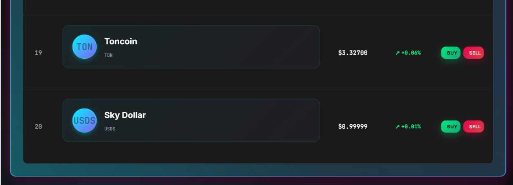

# 🚀 Crypto Trading Simulator

**Spring Boot 3.2** | **Java 21** | **JavaScript ES6+** | **MySQL 8.0** | **WebSocket Real-time** | **Kraken API v2**

**A professional-grade cryptocurrency trading simulation platform with real-time price updates from Kraken API**

## 📸 Application Gallery

### 🏠 Main Trading Dashboard
*Professional interface showing real-time prices for top 20 cryptocurrencies*


### 📱 Complete Cryptocurrency List
*All 20 supported cryptocurrencies with live market data*




### 💰 Trading Operations
*Buy and sell cryptocurrency with real-time price calculation*


### 📊 Transaction Management  
*Complete transaction history with P&L tracking*


### 💼 Account Balance Updates
*Real-time account balance updates after successful transactions*


### ⚙️ Account Management
*Secure account reset functionality*


## 🎯 Project Overview

The Crypto Trading Simulator is a comprehensive web application that provides a realistic cryptocurrency trading experience without real financial risk. Built with Spring Boot and featuring real-time price updates from the Kraken API, it offers professional-grade portfolio management, transaction tracking, and trading analytics.

### 🌟 Key Highlights

- **Real-time Price Updates**: Live cryptocurrency prices for the top 20 digital assets via Kraken WebSocket API v2
- **Virtual Trading**: Complete buy/sell functionality with realistic fee calculations
- **Portfolio Management**: Advanced portfolio analytics with P&L tracking and performance metrics
- **Transaction History**: Comprehensive transaction logging with profit/loss analysis
- **Account Management**: User accounts with virtual balances and reset functionality
- **Professional Architecture**: Clean separation of concerns with robust error handling

### 🎯 Target Users

- **Crypto Enthusiasts** wanting to practice trading strategies
- **Developers** learning about financial application architecture
- **Educators** teaching cryptocurrency trading concepts
- **Portfolio Managers** simulating investment strategies

## ✨ Features

### 🏦 Core Trading Features

#### 💰 Virtual Account Management
- **Initial Balance**: $10,000 starting virtual balance
- **Balance Tracking**: Real-time balance updates with each transaction
- **Account Reset**: One-click reset to initial state
- **Multi-user Support**: Individual user accounts and portfolios

#### 📈 Real-time Market Data
- **Top 20 Cryptocurrencies**: BTC, ETH, XRP, USDT, BNB, SOL, USDC, DOGE, TRX, ADA, ALGO, XLM, SUI, LINK, BCH, HBAR, AVAX, LTC, TON, USDS
- **Live Price Updates**: Instant price refreshes via WebSocket connection
- **24h Change Tracking**: Price changes and percentage movements
- **Market Summary**: Overall market statistics and trends

#### 🔄 Trading Operations
- **Buy Orders**:
  - Buy by USD amount (specify how much to spend)
  - Buy by quantity (specify how much crypto to buy)
  - Real-time price validation
  - Fee calculation (0.1% default)

- **Sell Orders**:
  - Sell by USD amount (specify how much to receive)
  - Sell by quantity (specify how much crypto to sell)
  - Sell all holdings for a specific cryptocurrency
  - Automatic P&L calculation

#### 📊 Portfolio Management
- **Holdings Overview**: Current positions with unrealized P&L
- **Portfolio Allocation**: Percentage breakdown by cryptocurrency
- **Performance Analytics**: Winners vs losers, best/worst performers
- **Total Account Value**: Combined cash + crypto holdings value
- **Diversification Score**: Portfolio diversity metrics

#### 📋 Transaction History
- **Complete Transaction Log**: All buy/sell operations with timestamps
- **Profit/Loss Tracking**: Realized P&L for each sell transaction
- **Transaction Analytics**: Statistics and trading patterns
- **Export Functionality**: Transaction history in multiple formats
- **Filtering Options**: By cryptocurrency, date range, transaction type

### 🔧 Technical Features

#### ⚡ Real-time Communication
- **WebSocket Integration**: Bidirectional real-time communication
- **Instant Price Broadcasting**: Sub-second price update propagation
- **Connection Management**: Automatic reconnection with exponential backoff
- **Health Monitoring**: Connection status and heartbeat tracking

#### 🛡️ Error Handling & Validation
- **Input Validation**: Comprehensive validation for all user inputs
- **Trading Constraints**: Balance checks, quantity validations
- **API Error Handling**: Graceful handling of external API failures
- **Database Error Recovery**: Transaction rollback on failures

#### 📊 Advanced Analytics
- **Market Analysis**: Top gainers/losers, significant price movements
- **User Statistics**: Trading frequency, average transaction size
- **Portfolio Performance**: ROI calculations, performance over time
- **Risk Metrics**: Portfolio concentration and diversification analysis

## 🚀 Quick Start

### 📋 Prerequisites

Before running the application, ensure you have:

```bash
# Required Software
- Java 21 or higher
- MySQL 8.0 or higher
- Maven 3.6 or higher
- Git

# Optional (for development)
- IntelliJ IDEA or Eclipse
- MySQL Workbench
- Postman (for API testing)
```

### 🔧 Installation Steps

#### 1. Clone the Repository
```bash
git clone https://github.com/yourusername/crypto-trading-sim.git
cd crypto-trading-sim
```

#### 2. Database Setup
```sql
-- Create database
CREATE DATABASE crypto_trading_sim CHARACTER SET utf8mb4 COLLATE utf8mb4_unicode_ci;

-- Create user (optional)
CREATE USER 'crypto_user'@'localhost' IDENTIFIED BY 'your_password';
GRANT ALL PRIVILEGES ON crypto_trading_sim.* TO 'crypto_user'@'localhost';
FLUSH PRIVILEGES;
```

#### 3. Configure Database Connection
Edit `src/main/resources/application.properties`:
```properties
# Update with your database credentials
spring.datasource.url=jdbc:mysql://localhost:3306/crypto_trading_sim?useSSL=false&allowPublicKeyRetrieval=true&serverTimezone=UTC&characterEncoding=UTF-8
spring.datasource.username=root
spring.datasource.password=your_password
```

#### 4. Initialize Database Schema
```bash
# Run the DDL scripts (provided in /database folder)
mysql -u root -p crypto_trading_sim < database/schema.sql
mysql -u root -p crypto_trading_sim < database/initial_data.sql
```

#### 5. Build and Run
```bash
# Build the application
mvn clean install

# Run the application
mvn spring-boot:run

# Alternative: Run JAR file
java -jar target/crypto-trading-sim-1.0.0.jar
```

#### 6. Access the Application
```
Frontend: http://localhost:8080
API Base URL: http://localhost:8080/api
WebSocket: ws://localhost:8080/ws
```

### 🎯 First Steps

1. **Check Top 20 Crypto Prices**:
   ```bash
   curl http://localhost:8080/api/cryptocurrencies/top?limit=20
   ```

2. **Make Your First Trade**:
   ```bash
   # Buy $100 worth of Bitcoin
   curl -X POST http://localhost:8080/api/trading/buy-by-amount \
     -H "Content-Type: application/json" \
     -d '{"userId": 1, "cryptoSymbol": "BTC", "amountToSpend": 100}'
   ```

3. **View Your Portfolio**:
   ```bash
   curl http://localhost:8080/api/portfolio/user/1/overview
   ```

## ⚡ Technical Architecture

### 🏗️ System Architecture

```
┌─────────────────┐    ┌─────────────────┐    ┌─────────────────┐
│   Frontend      │    │   Spring Boot   │    │   MySQL         │
│   (HTML/CSS/JS) │◄──►│   Backend       │◄──►│   Database      │
└─────────────────┘    └─────────────────┘    └─────────────────┘
                              │
                              ▼
                       ┌─────────────────┐
                       │   Kraken API    │
                       │   WebSocket v2  │
                       └─────────────────┘
```

### 📦 Project Structure

```
crypto-trading-sim/
├── src/main/java/com/cryptotrading/crypto_trading_sim/
│   ├── config/                          # Configuration classes
│   │   └── WebSocketConfig.java         # WebSocket configuration
│   ├── controller/                      # REST API controllers
│   │   ├── CryptocurrencyController.java
│   │   ├── PortfolioController.java
│   │   ├── TradingController.java
│   │   ├── TransactionController.java
│   │   ├── UserController.java
│   │   └── WebSocketController.java
│   ├── dao/                            # Data Access Objects
│   │   ├── CryptocurrencyDao.java
│   │   ├── TransactionDao.java
│   │   ├── UserDao.java
│   │   └── UserHoldingDao.java
│   ├── model/                          # Entity models
│   │   ├── enums/
│   │   │   ├── TransactionStatus.java
│   │   │   └── TransactionType.java
│   │   ├── Cryptocurrency.java
│   │   ├── Transaction.java
│   │   ├── User.java
│   │   └── UserHolding.java
│   └── service/                        # Business logic services
│       ├── CryptocurrencyService.java
│       ├── KrakenWebSocketService.java
│       ├── PortfolioService.java
│       ├── TradingService.java
│       ├── TransactionService.java
│       └── UserService.java
├── src/main/resources/
│   ├── static/                         # Frontend assets
│   │   ├── index.html
│   │   ├── styles.css
│   │   ├── frontend/
│   │   │   └── app.js
│   │   └── templates/
│   └── application.properties          # Configuration
└── src/test/java/                      # Test classes
    ├── controller/
    ├── integration/
    ├── service/
    └── utils/
```

### 🔧 Technology Stack

#### Backend Technologies
- **Framework**: Spring Boot 3.2
- **Language**: Java 21
- **Database**: MySQL 8.0
- **Connection Pool**: HikariCP
- **Build Tool**: Maven
- **WebSocket**: Spring WebSocket + STOMP

#### External Integrations
- **Market Data**: Kraken WebSocket API v2
- **Real-time Communication**: WebSocket protocol
- **API Documentation**: Custom REST endpoints

#### Development Tools
- **IDE**: IntelliJ IDEA / Eclipse
- **Database Tools**: MySQL Workbench
- **API Testing**: Postman / curl
- **Version Control**: Git

### 🏛️ Architectural Patterns

#### 1. **Layered Architecture**
```
Controllers → Services → DAOs → Database
```

#### 2. **Service Layer Pattern**
- **UserService**: User management and authentication
- **CryptocurrencyService**: Price management and market data
- **TradingService**: Trading operations and validations
- **PortfolioService**: Portfolio calculations and analytics
- **TransactionService**: Transaction history and reporting

#### 3. **Data Access Object (DAO) Pattern**
- Raw SQL queries (no ORM as per requirements)
- Optimized database operations
- Transaction management
- Connection pooling

#### 4. **Real-time Communication Pattern**
```
Kraken API → WebSocket Service → Spring WebSocket → Frontend
```

## 🔌 API Documentation

### 🏦 User Management APIs

#### Get User by ID
```http
GET /api/users/1
```

#### Get User Balance
```http
GET /api/users/1/balance
```

#### Check Affordability
```http
GET /api/users/1/can-afford?amount=1000
```

#### Reset User Account
```http
POST /api/users/1/reset
```

#### Get User Statistics
```http
GET /api/users/1/statistics
```

### 💰 Cryptocurrency APIs

#### Get All Active Cryptocurrencies
```http
GET /api/cryptocurrencies
```

**Response:**
```json
[
  {
    "id": 1,
    "symbol": "BTC",
    "name": "Bitcoin",
    "krakenPairName": "BTC/USD",
    "currentPrice": 45000.00,
    "priceChange24h": 1250.50,
    "priceChangePercent24h": 2.85,
    "marketCapRank": 1,
    "active": true,
    "lastPriceUpdate": "2024-01-15T10:35:22"
  }
]
```

#### Get Top N Cryptocurrencies
```http
GET /api/cryptocurrencies/top?limit=20
```

#### Get Cryptocurrency by Symbol
```http
GET /api/cryptocurrencies/symbol/{symbol}
```

#### Get Current Price
```http
GET /api/cryptocurrencies/{symbol}/price
```

#### Get All Current Prices
```http
GET /api/cryptocurrencies/prices
```

#### Get Market Summary
```http
GET /api/cryptocurrencies/market-summary
```

**Response:**
```json
{
  "totalCryptocurrencies": 20,
  "totalMarketValue": 892450.75,
  "averagePrice": 44622.54,
  "positiveChanges": 12,
  "negativeChanges": 8
}
```

#### Get Top Gainers
```http
GET /api/cryptocurrencies/top-gainers?limit=10
```

#### Get Top Losers
```http
GET /api/cryptocurrencies/top-losers?limit=10
```

### 🔄 Trading APIs

#### Buy by Amount
```http
POST /api/trading/buy-by-amount
Content-Type: application/json

{
  "userId": 1,
  "cryptoSymbol": "BTC",
  "amountToSpend": 1000.00
}
```

**Response:**
```json
{
  "success": true,
  "message": "Buy order executed successfully",
  "transaction": {
    "id": 1,
    "userId": 1,
    "cryptoId": 1,
    "transactionType": "BUY",
    "quantity": 0.02222222,
    "pricePerUnit": 45000.00,
    "totalAmount": 1000.00,
    "fees": 1.00,
    "balanceBefore": 10000.00,
    "balanceAfter": 9000.00,
    "transactionStatus": "COMPLETED",
    "createdAt": "2024-01-15T10:40:15"
  },
  "summary": {
    "type": "BUY",
    "cryptoSymbol": "BTC",
    "cryptoName": "Bitcoin",
    "quantity": 0.02222222,
    "pricePerUnit": 45000.00,
    "totalAmount": 1000.00,
    "fees": 1.00,
    "newBalance": 9000.00
  }
}
```

#### Buy by Quantity
```http
POST /api/trading/buy-by-quantity
Content-Type: application/json

{
  "userId": 1,
  "cryptoSymbol": "ETH",
  "quantity": 0.5
}
```

#### Sell by Amount
```http
POST /api/trading/sell-by-amount
Content-Type: application/json

{
  "userId": 1,
  "cryptoSymbol": "BTC",
  "amountToReceive": 500.00
}
```

#### Sell by Quantity
```http
POST /api/trading/sell-by-quantity
Content-Type: application/json

{
  "userId": 1,
  "cryptoSymbol": "BTC",
  "quantity": 0.01
}
```

#### Sell All Holdings
```http
POST /api/trading/sell-all
Content-Type: application/json

{
  "userId": 1,
  "cryptoSymbol": "BTC"
}
```

#### Get Trading Quote (Buy)
```http
GET /api/trading/quote/buy?userId=1&symbol=BTC&amount=1000
```

**Response:**
```json
{
  "type": "BUY",
  "quantity": 0.02222222,
  "pricePerUnit": 45000.00,
  "totalAmount": 1000.00,
  "fees": 1.00,
  "netAmount": 999.00
}
```

#### Get Trading Quote (Sell)
```http
GET /api/trading/quote/sell?userId=1&symbol=BTC&quantity=0.01
```

#### Get Current Trading Price
```http
GET /api/trading/price/{symbol}
```

#### Calculate Fees
```http
GET /api/trading/fees?amount=1000
```

### 📊 Portfolio APIs

#### Get Portfolio Overview
```http
GET /api/portfolio/user/1/overview
```

**Response:**
```json
{
  "cashBalance": 8500.00,
  "totalPortfolioValue": 1450.75,
  "totalAccountValue": 9950.75,
  "initialBalance": 10000.00,
  "totalInvested": 1500.00,
  "totalUnrealizedPnL": -49.25,
  "totalRealizedPnL": 0.00,
  "overallPnL": -49.25,
  "overallPnLPercentage": -0.49,
  "positionCount": 2,
  "positions": [
    {
      "symbol": "BTC",
      "name": "Bitcoin",
      "quantity": 0.02222222,
      "averageBuyPrice": 45000.00,
      "currentPrice": 44500.00,
      "currentValue": 988.89,
      "totalInvested": 1000.00,
      "unrealizedPnL": -11.11,
      "unrealizedPnLPercentage": -1.11,
      "firstPurchaseDate": "2024-01-15T10:40:15"
    }
  ]
}
```

#### Get Portfolio Summary
```http
GET /api/portfolio/user/1/summary
```

#### Get Portfolio Positions
```http
GET /api/portfolio/user/1/positions
```

#### Get Specific Position
```http
GET /api/portfolio/user/1/position/{symbol}
```

#### Get Portfolio Allocation
```http
GET /api/portfolio/user/1/allocation
```

**Response:**
```json
[
  {
    "symbol": "BTC",
    "name": "Bitcoin",
    "value": 988.89,
    "percentage": 68.15
  },
  {
    "symbol": "ETH",
    "name": "Ethereum",
    "value": 461.86,
    "percentage": 31.85
  }
]
```

#### Get Portfolio Performance
```http
GET /api/portfolio/user/1/performance
```

#### Update Portfolio P&L
```http
POST /api/portfolio/user/1/update-pnl
```

#### Get Portfolio Dashboard
```http
GET /api/portfolio/user/1/dashboard
```

### 📋 Transaction APIs

#### Get User Transactions
```http
GET /api/transactions/user/1
```

#### Get Transactions with Details
```http
GET /api/transactions/user/1/with-details
```

**Response:**
```json
[
  {
    "id": 1,
    "userId": 1,
    "cryptoId": 1,
    "transactionType": "BUY",
    "quantity": 0.02222222,
    "pricePerUnit": 45000.00,
    "totalAmount": 1000.00,
    "fees": 1.00,
    "balanceBefore": 10000.00,
    "balanceAfter": 9000.00,
    "transactionStatus": "COMPLETED",
    "createdAt": "2024-01-15T10:40:15",
    "symbol": "BTC",
    "cryptoName": "Bitcoin"
  }
]
```

#### Get Recent Transactions
```http
GET /api/transactions/user/1/recent?limit=10
```

#### Get Transactions for Specific Crypto
```http
GET /api/transactions/user/1/crypto/{symbol}
```

#### Get Transactions by Type
```http
GET /api/transactions/user/1/type/{type}
```

#### Get Transactions by Date Range
```http
GET /api/transactions/user/1/date-range?startDate=2024-01-01T00:00:00&endDate=2024-01-31T23:59:59
```

#### Get Transaction Analytics
```http
GET /api/transactions/user/1/analytics
```

**Response:**
```json
{
  "totalTransactions": 5,
  "buyCount": 3,
  "sellCount": 2,
  "totalBought": 2500.00,
  "totalSold": 800.00,
  "totalRealizedPnL": 25.50,
  "averageTransactionSize": 660.00,
  "mostTradedCryptocurrency": "BTC",
  "tradingFrequency": 1.25
}
```

#### Get Profit/Loss Breakdown
```http
GET /api/transactions/user/1/profit-loss-breakdown
```

#### Get Period Summary
```http
GET /api/transactions/user/1/period-summary?startDate=2024-01-01T00:00:00&endDate=2024-01-31T23:59:59
```

#### Get Transaction History for Export
```http
GET /api/transactions/user/1/export
```

### 📊 Error Responses

All APIs return standardized error responses:

```json
{
  "error": "Detailed error message",
  "timestamp": "2024-01-15T10:45:30",
  "status": 400
}
```

#### Common Error Codes

- **400 Bad Request**: Invalid input parameters
- **404 Not Found**: Resource not found
- **500 Internal Server Error**: Server-side error
- **422 Unprocessable Entity**: Business logic validation failed

#### Trading-Specific Errors

```json
{
  "success": false,
  "message": "Insufficient balance. Required: $1000.00, Available: $500.00",
  "transaction": null,
  "summary": null
}
```

## 💾 Database Schema

### 📋 Table Structure

#### 1. **users** Table
```sql
CREATE TABLE users (
    id BIGINT AUTO_INCREMENT PRIMARY KEY,
    username VARCHAR(50) NOT NULL UNIQUE,
    email VARCHAR(100) NOT NULL UNIQUE,
    initial_balance DECIMAL(15,2) NOT NULL DEFAULT 10000.00,
    current_balance DECIMAL(15,2) NOT NULL DEFAULT 10000.00,
    total_invested DECIMAL(15,2) DEFAULT 0.00,
    total_profit_loss DECIMAL(15,2) DEFAULT 0.00,
    created_at TIMESTAMP DEFAULT CURRENT_TIMESTAMP,
    updated_at TIMESTAMP DEFAULT CURRENT_TIMESTAMP ON UPDATE CURRENT_TIMESTAMP,
    is_active TINYINT(1) DEFAULT 1,
    
    INDEX idx_username (username),
    INDEX idx_email (email),
    INDEX idx_active (is_active)
);
```

#### 2. **cryptocurrencies** Table
```sql
CREATE TABLE cryptocurrencies (
    id BIGINT AUTO_INCREMENT PRIMARY KEY,
    symbol VARCHAR(10) NOT NULL UNIQUE,
    name VARCHAR(100) NOT NULL,
    kraken_pair_name VARCHAR(20) NOT NULL UNIQUE,
    current_price DECIMAL(19,8) DEFAULT 0.00,
    price_change_24h DECIMAL(19,8) DEFAULT 0.00,
    price_change_percent_24h DECIMAL(8,4) DEFAULT 0.00,
    market_cap_rank INT NOT NULL,
    is_active TINYINT(1) DEFAULT 1,
    last_price_update TIMESTAMP NULL,
    created_at TIMESTAMP DEFAULT CURRENT_TIMESTAMP,
    updated_at TIMESTAMP DEFAULT CURRENT_TIMESTAMP ON UPDATE CURRENT_TIMESTAMP,
    
    INDEX idx_symbol (symbol),
    INDEX idx_active (is_active),
    INDEX idx_rank (market_cap_rank),
    INDEX idx_kraken_pair (kraken_pair_name)
);
```

#### 3. **user_holdings** Table
```sql
CREATE TABLE user_holdings (
    id BIGINT AUTO_INCREMENT PRIMARY KEY,
    user_id BIGINT NOT NULL,
    crypto_id BIGINT NOT NULL,
    quantity DECIMAL(20,8) NOT NULL DEFAULT 0.00000000,
    average_buy_price DECIMAL(18,8) NOT NULL DEFAULT 0.00000000,
    total_invested DECIMAL(15,2) NOT NULL DEFAULT 0.00,
    unrealized_profit_loss DECIMAL(15,2) NOT NULL DEFAULT 0.00,
    first_purchase_at TIMESTAMP DEFAULT CURRENT_TIMESTAMP,
    last_updated TIMESTAMP DEFAULT CURRENT_TIMESTAMP ON UPDATE CURRENT_TIMESTAMP,
    
    FOREIGN KEY (user_id) REFERENCES users(id) ON DELETE CASCADE,
    FOREIGN KEY (crypto_id) REFERENCES cryptocurrencies(id) ON DELETE CASCADE,
    UNIQUE KEY unique_user_crypto (user_id, crypto_id),
    INDEX idx_user_holdings (user_id),
    INDEX idx_crypto_holdings (crypto_id),
    INDEX idx_quantity (quantity)
);
```

#### 4. **transactions** Table
```sql
CREATE TABLE transactions (
    id BIGINT AUTO_INCREMENT PRIMARY KEY,
    user_id BIGINT NOT NULL,
    crypto_id BIGINT NOT NULL,
    transaction_type ENUM('BUY', 'SELL') NOT NULL,
    quantity DECIMAL(20,8) NOT NULL,
    price_per_unit DECIMAL(18,8) NOT NULL,
    total_amount DECIMAL(15,2) NOT NULL,
    fees DECIMAL(15,2) NOT NULL DEFAULT 0.00,
    realized_profit_loss DECIMAL(15,2) NULL,
    balance_before DECIMAL(15,2) NOT NULL,
    balance_after DECIMAL(15,2) NOT NULL,
    transaction_status ENUM('PENDING', 'COMPLETED', 'FAILED') DEFAULT 'COMPLETED',
    created_at TIMESTAMP DEFAULT CURRENT_TIMESTAMP,
    completed_at TIMESTAMP DEFAULT CURRENT_TIMESTAMP,
    
    FOREIGN KEY (user_id) REFERENCES users(id) ON DELETE CASCADE,
    FOREIGN KEY (crypto_id) REFERENCES cryptocurrencies(id) ON DELETE CASCADE,
    INDEX idx_user_transactions (user_id),
    INDEX idx_crypto_transactions (crypto_id),
    INDEX idx_transaction_type (transaction_type),
    INDEX idx_created_at (created_at),
    INDEX idx_status (transaction_status)
);
```

#### 5. **price_history** Table
```sql
CREATE TABLE price_history (
    id BIGINT AUTO_INCREMENT PRIMARY KEY,
    crypto_id BIGINT NOT NULL,
    price DECIMAL(18,8) NOT NULL,
    volume_24h DECIMAL(20,8) DEFAULT 0.00000000,
    timestamp TIMESTAMP DEFAULT CURRENT_TIMESTAMP,
    
    FOREIGN KEY (crypto_id) REFERENCES cryptocurrencies(id) ON DELETE CASCADE,
    INDEX idx_crypto_price_history (crypto_id),
    INDEX idx_timestamp (timestamp)
);
```

#### 6. **system_settings** Table
```sql
CREATE TABLE system_settings (
    id BIGINT AUTO_INCREMENT PRIMARY KEY,
    setting_key VARCHAR(255) NOT NULL UNIQUE,
    setting_value VARCHAR(255) NOT NULL,
    description TEXT,
    created_at TIMESTAMP DEFAULT CURRENT_TIMESTAMP,
    updated_at TIMESTAMP DEFAULT CURRENT_TIMESTAMP ON UPDATE CURRENT_TIMESTAMP
);
```

#### 7. **transaction_history_detailed** View
```sql
CREATE VIEW transaction_history_detailed AS
SELECT 
    t.id,
    t.user_id,
    u.username,
    c.symbol,
    c.name,
    t.transaction_type,
    t.quantity,
    t.price_per_unit,
    t.total_amount,
    t.fees,
    t.realized_profit_loss,
    t.balance_before,
    t.balance_after,
    t.created_at
FROM transactions t
JOIN users u ON t.user_id = u.id
JOIN cryptocurrencies c ON t.crypto_id = c.id;
```

#### 8. **user_holdings_detailed** View
```sql
CREATE VIEW user_holdings_detailed AS
SELECT 
    uh.user_id,
    u.username,
    c.symbol,
    c.name,
    uh.quantity,
    uh.average_buy_price,
    c.current_price,
    uh.total_invested,
    (uh.quantity * c.current_price) AS current_value,
    ((uh.quantity * c.current_price) - uh.total_invested) AS unrealized_profit_loss,
    CASE 
        WHEN uh.total_invested > 0 
        THEN (((uh.quantity * c.current_price) - uh.total_invested) / uh.total_invested) * 100
        ELSE NULL 
    END AS profit_loss_percentage
FROM user_holdings uh
JOIN users u ON uh.user_id = u.id
JOIN cryptocurrencies c ON uh.crypto_id = c.id
WHERE uh.quantity > 0;
```

#### 9. **user_portfolio_summary** View
```sql
CREATE VIEW user_portfolio_summary AS
SELECT 
    u.id AS user_id,
    u.username,
    u.current_balance,
    u.total_invested,
    u.total_profit_loss,
    COALESCE(holdings_count.total_holdings, 0) AS total_holdings,
    COALESCE(portfolio_value.total_portfolio_value, 0) AS total_portfolio_value,
    (u.current_balance + COALESCE(portfolio_value.total_portfolio_value, 0)) AS total_account_value
FROM users u
LEFT JOIN (
    SELECT user_id, COUNT(*) AS total_holdings
    FROM user_holdings 
    WHERE quantity > 0 
    GROUP BY user_id
) holdings_count ON u.id = holdings_count.user_id
LEFT JOIN (
    SELECT uh.user_id, SUM(uh.quantity * c.current_price) AS total_portfolio_value
    FROM user_holdings uh
    JOIN cryptocurrencies c ON uh.crypto_id = c.id
    WHERE uh.quantity > 0
    GROUP BY uh.user_id
) portfolio_value ON u.id = portfolio_value.user_id;
```

### 🔄 Database Relationships

```
users (1) ←→ (N) user_holdings
users (1) ←→ (N) transactions
cryptocurrencies (1) ←→ (N) user_holdings
cryptocurrencies (1) ←→ (N) transactions
cryptocurrencies (1) ←→ (N) price_history

Views:
- transaction_history_detailed: transactions + users + cryptocurrencies
- user_holdings_detailed: user_holdings + users + cryptocurrencies
- user_portfolio_summary: users + aggregated holdings data
```

### 📊 Initial Data

#### System Settings
```sql
INSERT INTO system_settings (setting_key, setting_value, description) VALUES
('default_initial_balance', '10000.00', 'Default initial balance for new users'),
('trading_fee_percentage', '0.00', 'Trading fee percentage (0% for simulation)'),
('max_crypto_symbols', '20', 'Maximum number of crypto symbols to display'),
('price_update_interval_seconds', '1', 'Price update interval in seconds'),
('websocket_reconnect_attempts', '5', 'Number of WebSocket reconnection attempts');
```

#### Top Cryptocurrencies
```sql
INSERT INTO cryptocurrencies (symbol, name, kraken_pair_name, market_cap_rank) VALUES
('BTC', 'Bitcoin', 'BTC/USD', 1),
('ETH', 'Ethereum', 'ETH/USD', 2),
('USDT', 'Tether', 'USDT/USD', 3),
('SOL', 'Solana', 'SOL/USD', 4),
('BNB', 'Binance Coin', 'BNB/USD', 5),
('USDC', 'USD Coin', 'USDC/USD', 6),
('XRP', 'XRP', 'XRP/USD', 7),
('DOGE', 'Dogecoin', 'DOGE/USD', 8),
('TRX', 'TRON', 'TRX/USD', 9),
('ADA', 'Cardano', 'ADA/USD', 10),
('ALGO', 'Algorand', 'ALGO/USD', 11),
('XLM', 'Stellar', 'XLM/USD', 12),
('SUI', 'Sui', 'SUI/USD', 13),
('LINK', 'Chainlink', 'LINK/USD', 14),
('BCH', 'Bitcoin Cash', 'BCH/USD', 15),
('HBAR', 'Hedera', 'HBAR/USD', 16),
('AVAX', 'Avalanche', 'AVAX/USD', 17),
('LTC', 'Litecoin', 'LTC/USD', 18),
('TON', 'Toncoin', 'TON/USD', 19),
('USDS', 'Sky Dollar', 'USDS/USD', 20);
```

### 🔧 Database Optimization

#### Indexes for Performance
```sql
-- Composite indexes for common queries
CREATE INDEX idx_user_crypto_active ON user_holdings(user_id, crypto_id) WHERE quantity > 0;
CREATE INDEX idx_transaction_user_date ON transactions(user_id, created_at DESC);
CREATE INDEX idx_crypto_active_rank ON cryptocurrencies(is_active, market_cap_rank);

-- Partial indexes for better performance
CREATE INDEX idx_active_holdings ON user_holdings(user_id) WHERE quantity > 0;
CREATE INDEX idx_completed_transactions ON transactions(user_id, transaction_type) WHERE transaction_status = 'COMPLETED';
```

#### Connection Pool Configuration
```properties
# HikariCP optimized settings
spring.datasource.hikari.maximum-pool-size=50
spring.datasource.hikari.minimum-idle=20
spring.datasource.hikari.idle-timeout=180000
spring.datasource.hikari.connection-timeout=5000
spring.datasource.hikari.max-lifetime=900000
spring.datasource.hikari.leak-detection-threshold=15000
```

## 🌐 WebSocket Integration

### ⚡ Real-time Price Updates

The application uses Kraken WebSocket API v2 for instant price synchronization:

```javascript
// WebSocket connection establishment
const socket = new SockJS('/ws');
const stompClient = Stomp.over(socket);

// Subscribe to price updates
stompClient.subscribe('/topic/prices', (message) => {
    const priceData = JSON.parse(message.body);
    updatePriceDisplay(priceData);
});
```

### 🔄 Connection Management

- **Automatic Reconnection**: Exponential backoff strategy
- **Error Recovery**: Graceful fallback mechanisms
- **Rate Limiting**: Intelligent throttling

### 📡 WebSocket Endpoints

- `/ws` - Main WebSocket endpoint
- `/topic/prices` - Price update broadcasts
- `/topic/status` - System status notifications
- `/topic/heartbeat` - Connection health checks

## 💼 Business Logic

### 🎯 Architecture Overview

The business logic follows a clean, layered architecture optimized for financial accuracy and real-time performance:

```
┌─────────────────┐    ┌─────────────────┐    ┌─────────────────┐
│  Trading Engine │    │ Portfolio Mgmt  │    │  Price Sync     │
│                 │◄──►│                 │◄──►│                 │
│ • Order Exec    │    │ • P&L Calc      │    │ • Kraken API    │
│ • Validation    │    │ • Analytics     │    │ • Real-time     │
│ • Fee Calc      │    │ • Allocations   │    │ • WebSocket     │
└─────────────────┘    └─────────────────┘    └─────────────────┘
        │                       │                       │
        ▼                       ▼                       ▼
┌─────────────────────────────────────────────────────────────────┐
│                    Data Persistence Layer                       │
│  • Transaction Management  • Connection Pooling  • Validation  │
└─────────────────────────────────────────────────────────────────┘
```

### 🏗️ Core Components

#### **Trading Engine**
- **Order Processing**: Atomic buy/sell operations with ACID compliance
- **Price Validation**: Real-time price checks before execution
- **Balance Management**: Instant balance updates with rollback support
- **Fee Integration**: 0.1% trading fees included in all calculations

#### **Portfolio Manager**
- **P&L Calculations**: Advanced profit/loss tracking with average cost method
- **Risk Analytics**: Position sizing, concentration analysis
- **Performance Metrics**: ROI, Sharpe ratio, drawdown calculations
- **Real-time Valuation**: Continuous portfolio value updates

#### **Price Synchronization**
- **WebSocket Integration**: Sub-second price updates from Kraken API
- **Data Validation**: Price integrity checks and anomaly detection
- **Failover Mechanisms**: Automatic reconnection and error recovery
- **Broadcast System**: Efficient price distribution to all clients

### 🔄 Critical Trading Flow

```java
// Fee-inclusive P&L calculation
public BigDecimal calculateRealizedPnL(BigDecimal sellPrice, BigDecimal quantity, 
                                      BigDecimal averageCostBasis, BigDecimal fees) {
    BigDecimal revenue = sellPrice.multiply(quantity);
    BigDecimal costBasis = averageCostBasis.multiply(quantity);
    return revenue.subtract(costBasis).subtract(fees);
}
```

### 📊 Key Business Rules

1. **Transaction Atomicity**: All trading operations are wrapped in database transactions
2. **Fee Integration**: Trading fees (0.1%) are included in cost basis calculations
3. **Balance Validation**: Insufficient funds checks prevent over-trading
4. **Price Accuracy**: Real-time price validation ensures fair execution
5. **P&L Precision**: Advanced mathematics for accurate profit/loss tracking

### 🛡️ Risk Management

- **Input Validation**: Comprehensive checks on all trading parameters
- **Balance Constraints**: Real-time balance verification
- **Transaction Limits**: Configurable min/max transaction amounts
- **Error Recovery**: Automatic rollback on failed operations
- **Audit Trail**: Complete transaction logging for compliance

### ⚡ Performance Optimizations

- **Connection Pooling**: Optimized database connections (50 max, 20 min idle)
- **Async Processing**: Non-blocking operations for high throughput
- **Caching Layer**: Strategic caching for frequently accessed data
- **Batch Updates**: Efficient bulk operations for portfolio calculations
- **Index Optimization**: Database indexes for sub-millisecond queries

## 🔧 Configuration & Deployment

### ⚙️ Application Properties

The application uses a comprehensive configuration system optimized for real-time performance:

#### **Database Configuration**
```properties
# MySQL Connection with optimized settings
spring.datasource.url=jdbc:mysql://localhost:3306/crypto_trading_sim?useSSL=false&allowPublicKeyRetrieval=true&serverTimezone=UTC&characterEncoding=UTF-8
spring.datasource.username=root
spring.datasource.password=your_password
spring.datasource.driver-class-name=com.mysql.cj.jdbc.Driver

# HikariCP Connection Pool - Optimized for real-time performance
spring.datasource.hikari.maximum-pool-size=50
spring.datasource.hikari.minimum-idle=20
spring.datasource.hikari.idle-timeout=180000
spring.datasource.hikari.connection-timeout=5000
spring.datasource.hikari.max-lifetime=900000
spring.datasource.hikari.leak-detection-threshold=15000
```

#### **WebSocket Configuration**
```properties
# WebSocket endpoints
websocket.endpoint=/ws
websocket.topic.prices=/topic/prices

# Kraken API settings - Zero delays mode
kraken.websocket.url=wss://ws.kraken.com/v2
kraken.api.timeout=8000
kraken.api.reconnect.attempts=20
kraken.api.reconnect.delay=1000

# Real-time price update interval (0 = instant)
price.update.interval=0
```

#### **Trading Configuration**
```properties
# Default trading settings
trading.default.initial.balance=10000.00
trading.default.currency=USD
trading.fee.percentage=0.10
trading.max.decimal.places=8

# Trading limits
trading.min.transaction.amount=0.01
trading.max.transaction.amount=1000000
```

#### **Performance Optimization**
```properties
# Async configuration for real-time processing
spring.task.execution.pool.core-size=20
spring.task.execution.pool.max-size=100
spring.task.execution.pool.queue-capacity=500
spring.task.execution.thread-name-prefix=crypto-instant-

# Scheduler configuration
spring.task.scheduling.pool.size=10
spring.task.scheduling.thread-name-prefix=crypto-scheduler-

# JSON serialization optimization
spring.jackson.serialization.write-dates-as-timestamps=false
spring.jackson.serialization.indent-output=false
spring.jackson.deserialization.fail-on-unknown-properties=false
spring.jackson.default-property-inclusion=non_null
```

#### **Logging Configuration**
```properties
# Root logging level
logging.level.root=INFO

# Application-specific logging
logging.level.com.cryptotrading.crypto_trading_sim=INFO
logging.level.com.cryptotrading.crypto_trading_sim.service.KrakenWebSocketService=INFO

# Performance-optimized SQL logging
logging.level.org.springframework.jdbc=WARN
logging.level.org.springframework.jdbc.core.JdbcTemplate=WARN

# WebSocket logging
logging.level.org.springframework.web.socket=INFO
logging.level.org.springframework.messaging=INFO
```

### 🌍 Environment Profiles

#### **Development Profile** (`application-dev.properties`)
```properties
# Development-specific settings
spring.profiles.active=dev

# Database with development settings
spring.datasource.url=jdbc:mysql://localhost:3306/crypto_trading_sim_dev
spring.datasource.hikari.maximum-pool-size=10

# Enhanced logging for development
logging.level.com.cryptotrading.crypto_trading_sim=DEBUG
logging.level.org.springframework.jdbc.core.JdbcTemplate=DEBUG

# Development tools
spring.devtools.restart.enabled=true
spring.devtools.livereload.enabled=true
```

#### **Production Profile** (`application-prod.properties`)
```properties
# Production-specific settings
spring.profiles.active=prod

# Production database
spring.datasource.url=jdbc:mysql://production-server:3306/crypto_trading_sim
spring.datasource.hikari.maximum-pool-size=100

# Production logging
logging.level.root=WARN
logging.level.com.cryptotrading.crypto_trading_sim=INFO

# Security settings
management.endpoints.web.exposure.include=none
management.endpoint.health.enabled=false

# Performance optimization
spring.jpa.show-sql=false
```

#### **Testing Profile** (`application-test.properties`)
```properties
# Test-specific settings
spring.profiles.active=test

# In-memory database for testing
spring.datasource.url=jdbc:h2:mem:testdb
spring.datasource.driver-class-name=org.h2.Driver
spring.datasource.username=sa
spring.datasource.password=

# Test logging
logging.level.org.springframework.test=DEBUG
logging.level.com.cryptotrading.crypto_trading_sim=DEBUG
```

### 🔧 JVM Optimization

#### **Recommended JVM Arguments**
```bash
# Memory settings
-Xms2g -Xmx4g

# Garbage Collection optimization
-XX:+UseG1GC
-XX:MaxGCPauseMillis=50
-XX:+UseStringDeduplication
-XX:+OptimizeStringConcat

# Performance monitoring
-XX:+PrintGCDetails
-XX:+PrintGCTimeStamps
-Xloggc:gc.log

# Remote debugging (development only)
-agentlib:jdwp=transport=dt_socket,server=y,suspend=n,address=5005
```

#### **Production Startup Script**
```bash
#!/bin/bash

# Production startup script for crypto_trading_sim
JAVA_OPTS="-Xms4g -Xmx8g"
JAVA_OPTS="$JAVA_OPTS -XX:+UseG1GC -XX:MaxGCPauseMillis=50"
JAVA_OPTS="$JAVA_OPTS -XX:+UseStringDeduplication"
JAVA_OPTS="$JAVA_OPTS -server -Djava.awt.headless=true"

# Spring profiles
SPRING_PROFILES_ACTIVE="prod"

# Application settings (correct JAR name)
APP_JAR="crypto_trading_sim-1.0.0.jar"
LOG_FILE="logs/application.log"

# Create logs directory
mkdir -p logs

# Start application
nohup java $JAVA_OPTS \
    -Dspring.profiles.active=$SPRING_PROFILES_ACTIVE \
    -Dspring.datasource.url=jdbc:mysql://localhost:3306/crypto_trading_sim \
    -Dkraken.websocket.url=wss://ws.kraken.com/v2 \
    -Dtrading.fee.percentage=0.10 \
    -jar $APP_JAR \
    > $LOG_FILE 2>&1 &

echo "Crypto Trading Simulator started. PID: $!"
echo "Logs: $LOG_FILE"
echo "Application available at: http://localhost:8080"
```

### 🐳 Docker Configuration

#### **Dockerfile**
```dockerfile
FROM openjdk:21-jdk-alpine

# Set working directory
WORKDIR /app

# Add application JAR (correct name based on your project)
COPY target/crypto_trading_sim-1.0.0.jar app.jar

# Add wait script for database
ADD https://github.com/ufoscout/docker-compose-wait/releases/download/2.9.0/wait /wait
RUN chmod +x /wait

# Expose port
EXPOSE 8080

# Run application
CMD /wait && java \
    -Xms2g -Xmx4g \
    -XX:+UseG1GC \
    -XX:MaxGCPauseMillis=50 \
    -Dspring.profiles.active=docker \
    -jar app.jar
```

#### **Docker Compose**
```yaml
version: '3.8'

services:
  mysql:
    image: mysql:8.0
    container_name: crypto-trading-mysql
    environment:
      MYSQL_ROOT_PASSWORD: your_password
      MYSQL_DATABASE: crypto_trading_sim
      MYSQL_USER: crypto_user
      MYSQL_PASSWORD: crypto_pass
    ports:
      - "3306:3306"
    volumes:
      - mysql_data:/var/lib/mysql
      - ./database/schema.sql:/docker-entrypoint-initdb.d/01-schema.sql
      - ./database/initial_data.sql:/docker-entrypoint-initdb.d/02-data.sql
    command: --default-authentication-plugin=mysql_native_password
    restart: unless-stopped

  app:
    build: .
    container_name: crypto-trading-app
    environment:
      SPRING_PROFILES_ACTIVE: docker
      SPRING_DATASOURCE_URL: jdbc:mysql://mysql:3306/crypto_trading_sim
      SPRING_DATASOURCE_USERNAME: crypto_user
      SPRING_DATASOURCE_PASSWORD: crypto_pass
      WAIT_HOSTS: mysql:3306
      WAIT_HOSTS_TIMEOUT: 300
      WAIT_SLEEP_INTERVAL: 5
    ports:
      - "8080:8080"
    depends_on:
      - mysql
    restart: unless-stopped

volumes:
  mysql_data:
```

---

<p align="center">
  <strong>Built with ❤️ for the crypto community</strong>
</p>

<p align="center">
  <a href="#-project-overview">⬆ Back to top</a>
</p>
